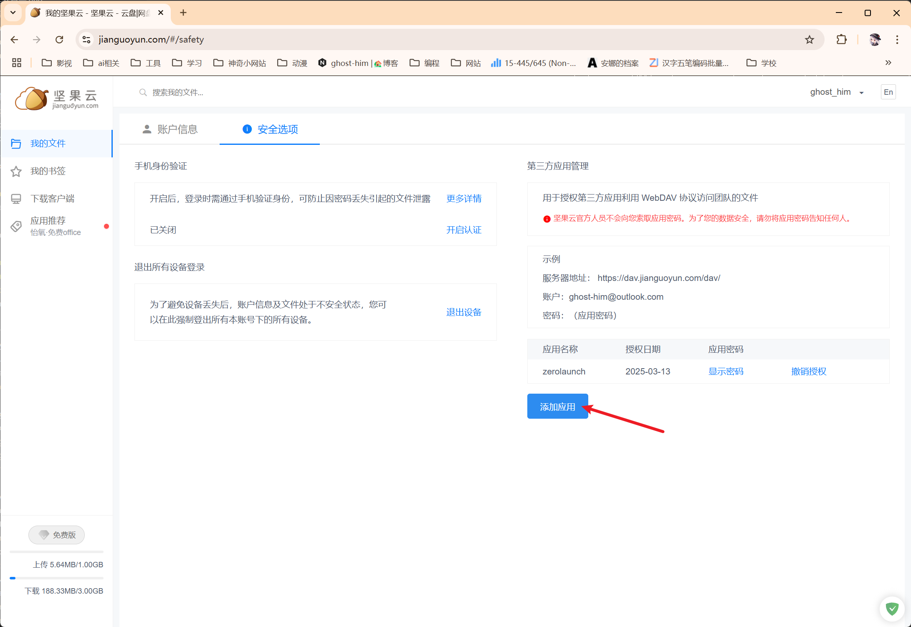

# Implementation Methods for Common Features

## Some Unused Programs Are Added

Common unused programs include:
* Uninstallers for various programs
* Help documentation for various programs

These programs are already included in the default blocklist. If other unlisted programs need to be blocked, follow these steps:
1. Open the settings interface
2. Click "程序搜索"
3. Click "设置屏蔽关键字"
4. Click "添加项目"
5. Enter the program name to block
6. Click "保存配置文件" – the program will automatically save and reload the configuration

Any program containing the keyword will be blocked. For example, adding `help` will block all programs with names like `xxx help`.

## Programs Installed in Custom Paths Are Not Detected

The program scans default installation paths. To add custom installation paths:
1. Open the settings interface
2. Click "程序搜索"
3. Click "设置遍历路径"
4. Click "添加项目"
5. Add the installation directory and set traversal depth
6. Click "保存配置文件" – the program will automatically save and reload the configuration

Related: [What is Traversal Depth?](#what-is-traversal-depth)

## Adding Files/URLs/Commands (Including Windows Settings and Consoles)

1. Open the settings interface
2. Click "其他搜索"
3. Select the corresponding tab
4. Complete the addition
5. Click "保存配置文件" – the program will automatically save and reload the configuration

Related: [What is a Keyword?](#what-is-a-keyword)

**Adding Windows Settings**:  
Use command: `explorer.exe ms-settings:[target]`.  
Example for display settings: `explorer.exe ms-settings:display`

**Adding Management Consoles**:  
List available consoles using:  
`Get-ChildItem -Path C:\Windows\system32\* -Include *.msc | Sort-Object -Property Extension | Select-Object -Property Name | Format-Wide -Column 1`  
Launch consoles with: `mmc [target]`.  
Example for Group Policy Editor (`gpedit.msc`): `mmc gpedit.msc`

## How to Fine-Tune the Search Algorithm

First, it is essential to understand the processing flow of this search algorithm. It is recommended to review the corresponding code implementation in `src-tauri/src/modules/program_manager/mod.rs`, where the function for updating the search algorithm is `update`.

The core of this search algorithm is that for a user's input, each program has a "matching score," which represents the likelihood that the user's intended target is the current program. A higher matching score indicates a greater probability that the user's target program is the current one. Therefore, the results displayed in the list are the programs with the highest matching scores.

A program's matching score consists of three components: **string matching score** + **fixed weight** + **dynamic weight**.
* **String matching score**: Calculated based on the user's input and the search keywords (fixed variation).
* **Fixed weight**: A user-defined static weight assigned to the target program (determined by the user).
* **Dynamic weight**: Computed dynamically based on historical launch frequency.

Users can modify the value of the **fixed weight**. Note that the assignment of fixed weight is the same as that of the **blocked keywords**.

The method to modify its value is as follows:

1. Open the Settings interface
2. Click "程序搜索"
3. Click "设置固定偏移量"
4. Click "添加项目"
5. Set the corresponding values
6. Click "保存配置文件"

## Changing Configuration File Storage Path

1. Open the settings interface
2. Click "远程管理"
3. Click "选择目标路径"
4. Choose the desired folder – configurations will auto-save to the new location


## Changing the Configuration File Save Location

### Changing the Local Save Path
1. Open the settings interface
2. Click "Remote Management"
3. Click "Local Storage"
4. Click the "Select Path" button
5. Choose your target folder. The configuration will auto-save upon successful selection
6. Click "Test Connection"
7. Click "Save Configuration"

A test file will be created in the target folder during connection testing, which can be manually deleted.

### Connecting to Cloud Storage via WebDAV Protocol
Demonstration using Jianguoyun (Nutstore):
1. Open the settings interface
2. Click "Remote Management"
3. Click "WebDAV"
4. Visit Jianguoyun official website: `https://www.jianguoyun.com/#/safety`
5. Click "Add Application" to obtain an application password



6. Enter the corresponding credentials
7. Click "Test Connection"
8. Click "Save Configuration"

# FAQs

## What is a Keyword?  
A keyword serves as the unique identifier for the search algorithm to locate specific items.

## What is Traversal Depth?  
Example for path `C:\Program Files\` (depth=5):

```
Initial Path: C:\Program Files\ (5-layer depth)
├── App1/              ✔️ Indexed (Layer 1)
│   └── Subfolder/     ✔️ Indexed (Layer 2)
│       ├── Config/    ✔️ Indexed (Layer 3)
│       └── Cache/     ✔️ Indexed (Layer 3)
└── App2/
    └── Components/
        └── Plugins/
            └── Legacy/
                └── Layer5/    ✔️ Indexed (Layer 5)
                    └── Layer6 ❌ Ignored (exceeds depth)
```

## Program Crashes  
Logs are stored in `C:\Users\[Current User]\AppData\Roaming\ZeroLaunch-rs\logs`, containing startup logs and crash records.

## Shortcut Key is Occupied

Open the system tray, find the thumbnail of `ZeroLaunch-rs`, right-click to open the secondary menu bar, and click "重新注册快捷键".

**This content was translated by DeepSeek-R1.**